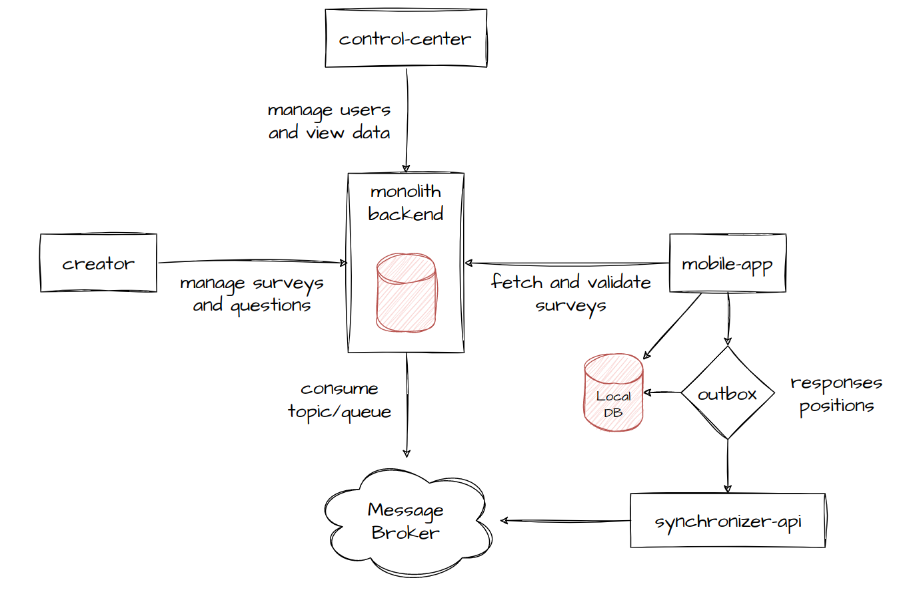

# 28 de fevereiro de 2023 - Follow up Tech

## Participantes
- Dominick Brasileiro
- Emanoel Alves Junior

## Anotações
- Dominick apresentou as plataformas que utilizaremos no projeto:
  - Nova organização no GitHub: https://github.com/allgor-data;
  - Documentação interna: https://github.com/allgor-data/internal-docs;
  - Notas de reunião: https://github.com/allgor-data/internal-docs/tree/master/meeting-notes;
  - GitHub Projects para gerenciar tarefas.
- Decidimos por **não continuar** com a lib SurveyJS, para não ter vendor lock-in:
  - Também levamos em conta a falta de pacotes oficiais para Flutter.
    O [flutter_survey_js](https://pub.dev/packages/flutter_survey_js) não é tão popular e não tem uma boa API.
- Dominick apresentou uma proposta de desenvolvimento seguindo o seguinte diagrama:\
  
- Emanoel levantou pontos importantes em relação a sincronização offline, afirmando que alguns dados
  deveriam ser sincronizados o mais cedo possível, enquanto outros poderiam ser sincronizados em outro momento. Por exemplo:
  - Ao finalizar uma pesquisa, o aplicativo deve sincronizar o ponto como "concluído" o mais cedo possível;
  - Respostas de pesquisas poderiam ser enviadas depois, para economizar dados móveis do pesquisador;
  - Posições em tempo real devem ser enviadas em um outro momento, apenas para fins de auditoria.
- Após discutirmos os pontos acima, decidimos adicionar uma feature de prioridade as mensagems do outbox. Por exemplo:
  - Prioridade alta: mensagens que devem ser sincronizadas assim que o dispositivo estabelecer uma conexão estável à internet;
  - Prioridade baixa: mensagens que podem ser sincronizadas assim que o dispositivo estiver conectado ao Wi-Fi.
- Discutimos sobre utilizar o Amazon SQS como "Message Broker", a fim de garantir a entrega das mensagens do sincronizador;
- Optamos por não trabalhar com ortofotos no primeiro momento, para otimizar o tempo de desenvolvimento;
- Dominick apresentou uma proposta de etapas de desenvolvimento de 12 semanas:
  - Semana 1:
    - backend authentication 
    - backend user management
  - Semana 2:
    - mobile structure 
    - mobile authentication
  - Semana 3:
    - mobile form structure 
    - mobile form conditional logic
  - Semana 4:
    - backend survey management 
    - backend response storage
  - Semana 5:
    - mobile outbox responses 
    - synchronizer-api
  - Semana 6:
    - frontend basic forms and conditional logic
  - Semana 7:
    - backend view responses 
    - frontend view responses
  - Semana 8: survey validation
  - Semana 9:
    - mobile outbox positions 
    - frontend view positions
  - Semana 10:
    - frontend add survey points 
    - mobile maps view and select survey point
  - Semana 11:
    - frontend main dashboards
  - Semana 12:
    - first release candidates 
    - deployment, testing
- O prazo de 12 semanas é extremamente otimista. Devemos considerar imprevistos ou mudanças ao decorrer do projeto;
- Dominick apresentou um protótipo em Flutter com formulários dinâmicos.
  Discutimos formas de renderizar as questões e organizar os arquivos.

## Anexos
- [allgor.drawio](../assets/allgor.drawio)

## Ações
- [ ] Dominick - Organizar board e tasks do projeto
